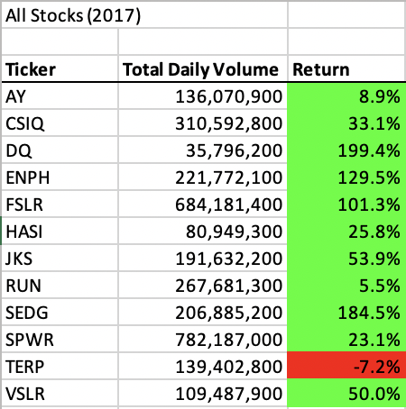
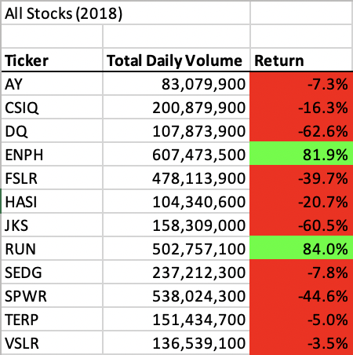
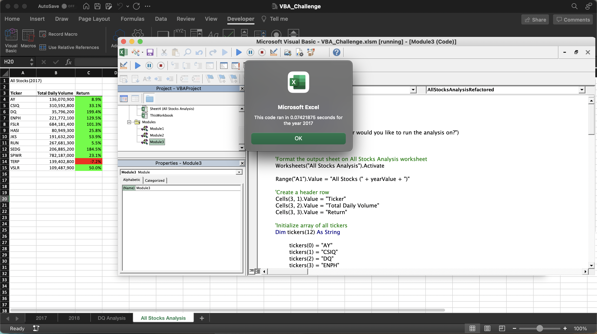
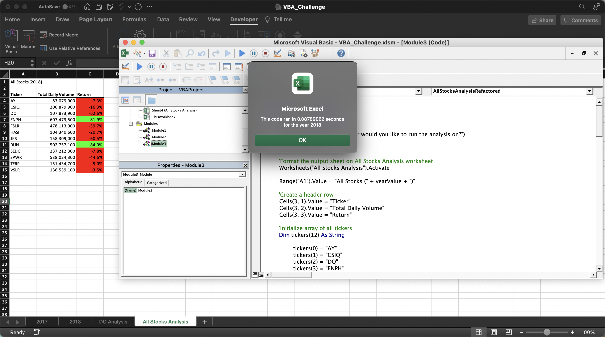

# Stocks Analysis with VBA

## Project Overview

The purpose of this project is to use VBA to create marco so the stakeholders can easily get the results for the stocks analysis of the year they desired.

## Results

From the results of the 2017 stocks analysis, we can see all of the stocks but "TERP" has positive returns, and the top 3 performers are 

- "DQ" with 199.4% of return, 
- "SEDG" with 184.5% of return and 
- "ENPH" with 129.5% of return. 

Overall, 2017 is a good year for most of the stocks we have listed.

With the results we get from the 2018 stocks analysis, we can see most of the stocks have the negative returns, the top 3 of the worst peformers are

- "DQ" with -62.6% of return, 
- "JKS" with -60.5% of return, 
- "SPWR" with -44.6% of return. 

But we can also see **"ENPH"** still have **81.9%** of return, during 2017 - 2018 **"ENPH"** has total **211.4%** of return which made it the top performer out of all stocks. The other stock that has positive return for both years is **"RUN"**, in 2017, it has a small 5.5% of return, but in 2018 it gained momentum and has the highest return of **84%**.

### Runtime for original script and refactored script
2017 Original Script Runtime

2018 Original Script Runtime

2017 Refactored Script Runtime

2018 Refactored Script Runtime

## Summary

With the result we got from both 2017 and 2018, we can see that "ENPH" and "RUN" would be good choices to invest for long term during the 2 years period, the top performers such as "DQ", "SEDG" could good for short term but have to closely monitor the performance and set a target price and/or stop loss point.

#### 1. What are the advantages or disadvantages of refactoring code?

The advantage is that it reduced the runtime. Disadvantages for me personally is that at first I was confused about the code by adding tickerIndex and using it to access the tickers array, and why to create the 3 out put as array, but I think to create output as arrays helps to process and store the respective array elements, which helps with the runtime.

#### 2. How do these pros and cons apply to refactoring the original VBA script?

